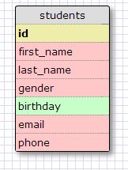
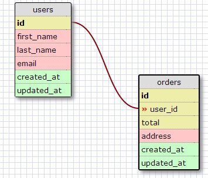
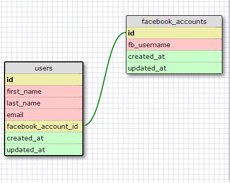
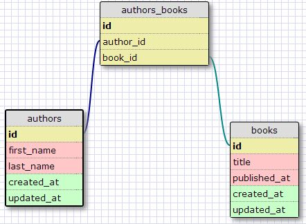
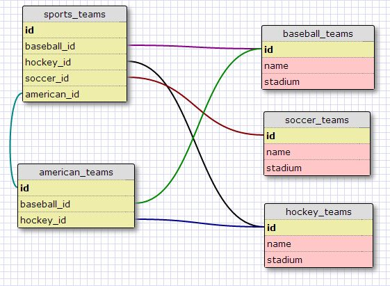

# U3.W7: Designing Schemas

#### I worked on this challenge [by myself, with: ]

## Release 0: Student Roster Schema

## Release 1: One to Many Schema

## Release 2: One to One Schema

## Release 3: Many to Many Schema

## Release 4: Design your own Schema
Description of what you're modeling: 

## Release 5: Reflection
Very interresting. I did not know anything about designing schemas, or that they even existed. I have a broader perspective on how large some schemas can be later on. I understand the ideas somewhat, but the most trouble from this exercise was learning how to use the wwww SQL designer tool. It seems clunky and I feel there may be a better tool out there. Is this the preferred tool at dbc?