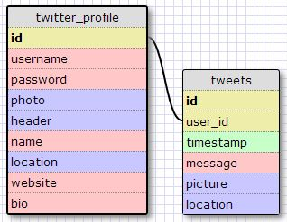

# U3.W7: Modeling a Real-World Database (SOLO CHALLENGE)

## Release 0: Users Fields
- id
- username
- password
- photo
- header
- name
- location
- website
- bio

## Release 1: Tweet Fields
- id
- user_id
- timestamp
- message
- picture
- location

## Release 2: Explain the relationship
The relationship between `users` and `tweets` is: 
users is the profile data for a user that is connected to the tweets data from the specific user.

## Release 3: Schema Design

## Release 4: SQL Statements
#### Tweets from a specific person
SELECT timestamp, message, photo, location
  FROM tweet WITH user_id = 1234

#### Tweets from a specific date
SELECT message, photo, location
 FROM tweet WITH timestamp = (date)

#### Collect user information from a tweet
 SELECT username, name, location,  website, bio
  FROM tweet JOIN twitter_profile IN user_id = id
  WITH message = (message)

## Release 5: Reflection
This is definitely a crude version of what I imagine twitter's database to be. I am wondering how they connect followers, following, and hashtags in these databases. As I am still a newbie at sql databases, I will need to ponder that for a while. I was confused how to connect the user table to the tweet table. I first wanted to connect both id fields, but each tweet needs to have it's own specific id, so I made a user_id field that would be the same as the id on the user table. I am unsure if I would need the name of the user in the tweet table, but I imagine it can easily be taken from the twitter_profile table since they are connected. 